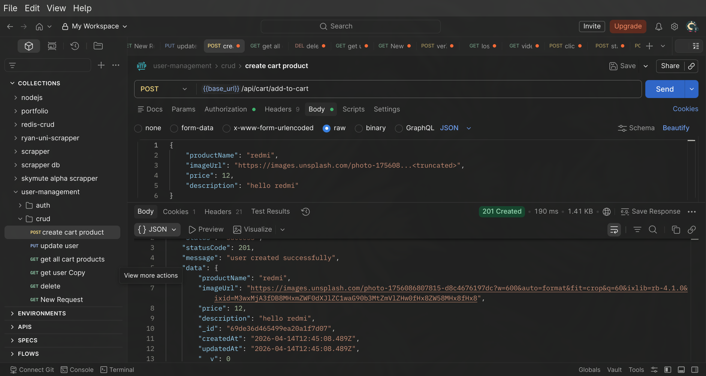
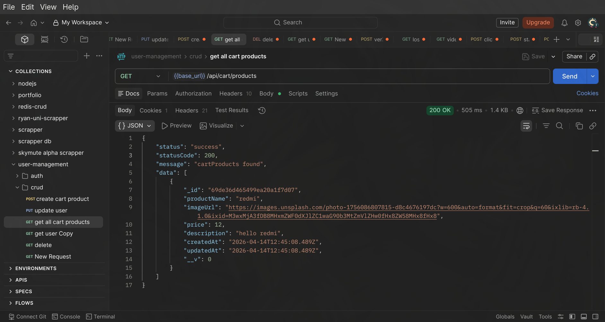

# Backend (Server) Documentation

## Overview

This document describes the backend (server-side) implementation of the **Student Management System**.
The server is built using **Node.js** and **Express.js** and uses **session-based authentication** backed by **MongoDB**.

Authentication is handled using **express-session** with **connect-mongo** as the session store.
Cookies are managed internally by `express-session`; **cookie-parser is not used** in this application.

---

## Technology Stack

- **Node.js** – JavaScript runtime
- **Express.js (v5)** – Web framework
- **MongoDB** – Database
- **Mongoose** – MongoDB ODM
- **express-session** – Session management
- **connect-mongo** – MongoDB-backed session store
- **bcryptjs** – Password hashing
- **cors** – Cross-Origin Resource Sharing
- **helmet** – Security headers
- **morgan** – HTTP request logging
- **pino / pino-pretty** – Application logging
- **joi** – Request validation

---

## Project Structure

server

- src
  - models
  - controllers
  - utils
  - routes
  - middlewares

---

## Server Entry Point

- The application entry point is `index.js`
- Environment variables are loaded using Node’s `--env-file` option
- Database connection is established before starting the server

---

## Middleware Configuration

### CORS

```js
cors({
  origin: env.CLIENT_BASE_URL,
  credentials: true,
});
```

## sessions

Key session settings:

- Session data is stored in MongoDB
- Session cookies are HTTP-only
- Cookies are automatically handled by express-session

### Authentication & Authorization

Session-Based Authentication

- User authentication is session-based
  - On successful login:
    - User data is stored in req.session.user
    - A session cookie is sent to the client
      -Browser automatically sends the cookie with each request

### Authorization Middleware (isAuth)

Protected routes use an authentication middleware:
Responsibilities:

- Check for an active session
- Verify req.session.user
- Allow request if session is valid
- Reject request with 401 Unauthorized if not authenticated

### API Routes

#### Authentication Routes

```bash
/api/auth
```

**_Typical actions:_**

- Login
- register
- Logout
- Session creation and destruction

```bash
/api/cart
```

**_Typical operation:_**

- add to cart

```
  Adds a product to the cart.

Method: POST
URL: {{base_url}}/api/cart/add-to-cart

Request body:

- productName (string): Name of the product
- imageUrl (string): Product image URL
- price (number): Product price
- description (string): Product description

Success response:

- Status: 201 Created
- Returns a success message and the created cart item in `data`
```



- get All users

```
Returns all products currently present in the authenticated user's cart.

Use this request to fetch the cart product list for the active session. The request is sent to `GET {{base_url}}/api/cart/products` and relies on the session cookie (`connect.sid`) being available.

A successful `200 OK` response returns a wrapper object with:

- `status`: request outcome
- `statusCode`: HTTP-style status value
- `message`: summary such as `cartProducts found`
- `data`: array of cart product objects

Each item in `data` includes fields such as `_id`, `productName`, `imageUrl`, `price`, `description`, `createdAt`, `updatedAt`, and `__v`.
```



#### utility routes

- health check

```bash
GET /
```

- session check

```bash
GET /api/me
```

### error handling

- all users are normalized by ApiError
- ApiError extended from Error class
- logged all error by pino logger

### security

- Passwords are hashed using bcryptjs
- Session cookies are HTTP-only
- Secure cookies are enabled in production
- Helmet adds common security headers
- No sensitive data is exposed to the client

### env

PORT=3000
NODE_ENV="development" #production
MONGO_URI= " "
CLIENT_BASE_URL="http://localhost:5173"
SESSION_SECRET=""
JWT_SECRET=""
